# Tablero de indicadores
El objetivo del trablero es proveer una herramienta para el análisis de los datos del indicador de manera dinámica y que el usuario pueda interactuar para mostrar los datos de la forma que más le sea útil. Para ingresar elija en el menú principal **Indicadores -> Tablero**

##Pestaña indicadores
Esta pestaña muestra el listado de indicadores agrupados según su clasificación técnica. Puede elegir la clasificación con la que desea mostrar el listado usando el botón **Clasificación** la dar clic en él se mostrarán las clasificaciones disponibles. La clasificación seleccionada se mostrará al lado derecho del botón.

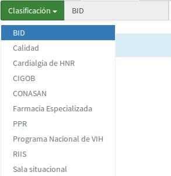

Si desea buscar algún indicador, posee un cuadro de texto donde puede ingresar parte del nombre y el listado se filtrará con los datos ingresados.

Para elegir un indicador del listado y mostrar su gráfico basta con dar clic sobre el nombre de éste, y se pasará a la pestaña **Gráficos**

## Pestaña Gráficos
Los indicadores seleccionados del listado se mostrarán en esta sección que tendrá un aspecto similar al mostrado en la siguiente figura
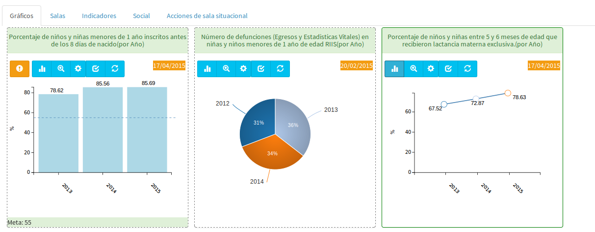

Veamos los elementos disponibles con cada gráfico

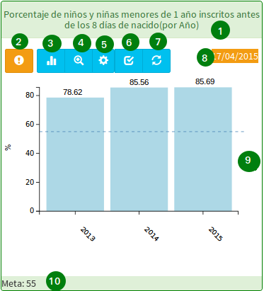

### 1. Título del gráfico.
Es el nombre del indicador que se está graficando, este valor es tomado de la ficha técnica.

### 2. Rangos de alertas.
Si se han definidos rangos de alertas para el indicador se mostrará el cuadro con el detalle de estos rangos: límite inferior, límite superior, color del rango y un comentario explicativo.
Cada elemento del gráfico se mostrará con el color del rango al cual pertenece, si no existen rangos de alertas se usarán colores aleatoreos para mostrar el gráfico. Por ejemplo se puede definir en la ficha técnica que los elementos del gráfico cuyo valor esté entre 20 y 30 se muestren de color rojo.

###3. Botón opciones del gráfico.
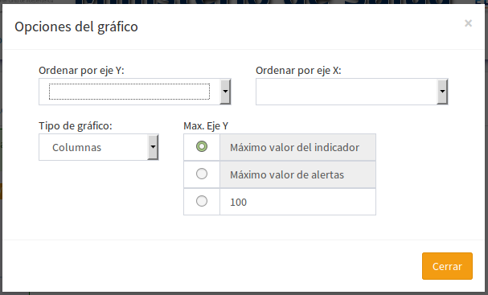

Aquí se encuentran las opciones para cambiar el tipo de orden de los datos que se muestran en los ejes X y Y, cambiar el tipo de gráfico y cambiar el máximo valor del eje Y; en este último se puede elegir entre el máximo valor de los datos (valor por defecto), el máximo valor de los rangos de alertas (si fueron definidos) o un valor ingresado por el usuario.

Podemos elegir el tipo de gráfico: Columnas, líneas, mapa, circular, entre otros. El usuario podrá elegir el gráfico que represente mejor los datos, cada uno de estos gráficos es interactivo.
En el caso de que la variable sea de tipo geográfica y exista un mapa asociado a ella, se dispondrá de este tipo de gráfico, para acercar el mapa se usará clic derecho de igual manera clic derecho sobre el mismo elemento para alejar, si se da clic sobre otro elemento cuando el mapa tiene un acercamiento se pasará ese elemento al centro.

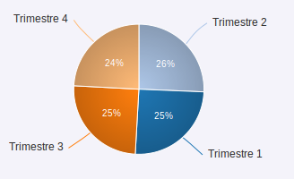
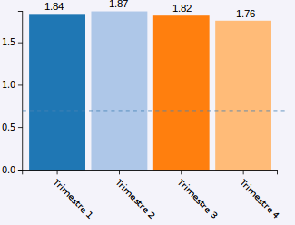
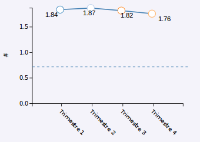
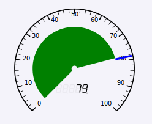
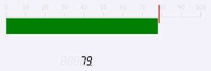
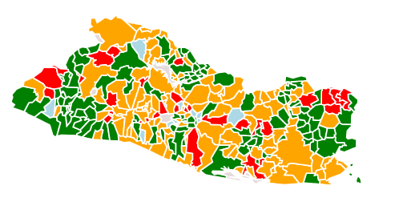

###4. Botón zoom.
Permite pasar a modo de pantalla completa utilizando el gráfico seleccionado, en este modo el gráfico sigue siendo interactivo y para salir se debe presionar la tecla *Escape*

###5.Botón opciones.
Este mostrará opciones generales tales como:
- Ver ficha técnica
- Cambiar vista gráfico / tabla de datos. Si desea mostrar la tabla con los datos en lugar del gráfico.
- Ver SQL. Utilizado para recuperar la sentencia SQL que se utiliza para recuperar los datos de la base.
- Descargar gráfico. Descarga el gráfico en un archivo de imagen.
- Quitar indicador. Quita el gráfico del tablero
- Marcar como favorito. Para que aparezca en el grupo de **Favoritos**

### 6. Botón opciones de dimensión
Aquí podemos cambiar dimensión, podemos elegir la dimensión/variable que se quiere graficar.
Filtrar: Podemos realizar el filtrado de los elementos que se muestran en el gráfico de dos formas

1. Todos los elementos que se muestran en el gráfico estarán disponibles como listado para poder seleccionar los que deseemos mostrar en el gráfico.
2. Filtrar por posición, elegimos que posiciones se mostrarán, por ejemplo los primeros 5 elementos, los últimos 10, desde el tercero al 7, etc.

Podemos combinar las diferentes opciones para adecuar el gráfico. Por ejemplo: Si queremos mostrar los 5 elementos con mayor índice, ordenamos el gráfico por indicador y aplicamos un filtro con límite superior 5

### 7. Recargar
Se utiliza para recargar el gráfico con las opciones por defecto, tal como se mostró al elegirlo en el listado de indicadores

### 8. Fecha de última lectura
En formato dd/mm/aaaa. Se toma la fecha más reciente en que se realizó la última lectura de cada origen de datos asociado al indicador

### 9. Zona del gráfico
Es la parte donde se mostrará el gráfico, los elementos son interactivos. Cada vez que se dé clic sobre un elemento del gráfico se creará un filtro con el valor seleccionado, podemos aplicar filtros de acuerdo a la cantidad de variables disponibles para el indicador, además se puede regresar y quitar un filtro dando clic en el nivel deseado.

### 10. Meta
Es el valor especificado en la ficha técnica como meta del indicador.

## Pestaña Sala

Un grupo de gráficos, se puede guardar con sus respectivas configuraciones: orden, filtro, tipo de gráfico, entre otras. A esto se le llama *Sala situacional*
Al dar clic en el nombre de una sala se recuperan los gráficos con sus respectivas configuraciones guardadas.
Si se da clic en el botón a la izquierda del nombre de cada sala se recupera esa sala en un archivo pdf para ser descargado.

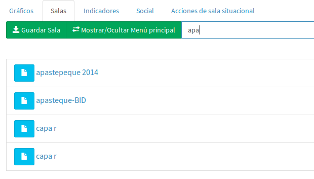

## Pestaña Social
Cuando se carga una sala situacional, en la ficha *Social* dispondremos de las opciones para compartir la sala con otros usuarios, solo la puede compartir el usuario que creó la sala o el usuario administrador, también podemos agregar comentarios cortos al estilo de un chat.

